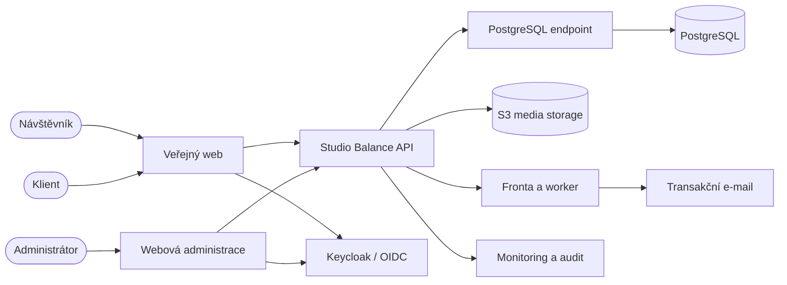
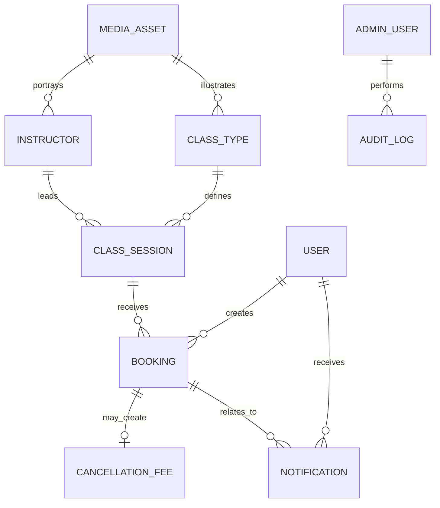
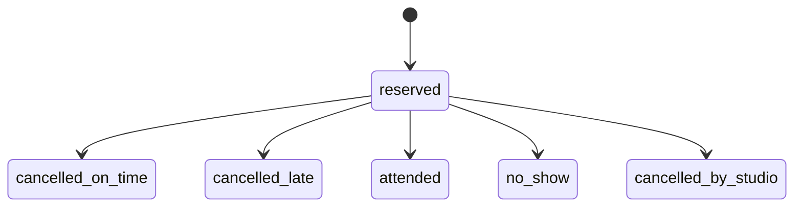
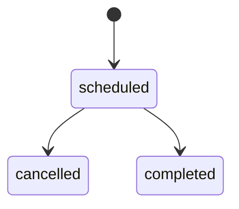
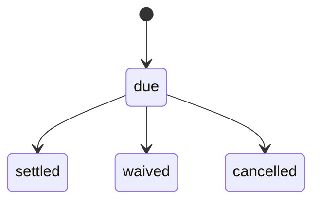
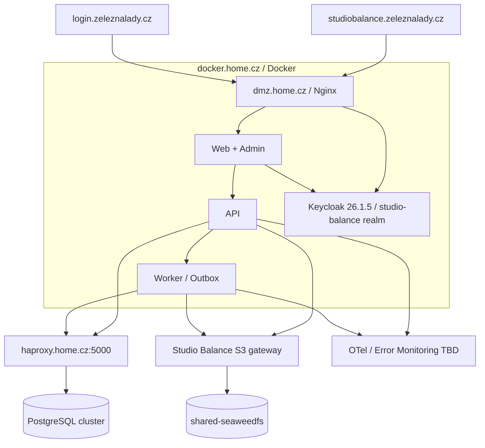

# Architektura

## Status

Toto je cílová architektura odvozená ze zadání. Aplikační stack je `Accepted` v
ADR 0003, identita v ADR 0004 a první platformní baseline v ADR 0005. Produkční
a lokální topologie je schválená v ADR 0002.
Neexistující komponenty se v tomto dokumentu nesmějí prezentovat jako nasazené.

Aktuálně implementovaný řez obsahuje Next.js web, NestJS/Fastify API,
samostatný worker, generované OpenAPI typy, PostgreSQL migraci, request ID,
strukturované logy a lokální PostgreSQL/Keycloak Compose. Identity řez obsahuje
Keycloak Authorization Code + PKCE, oddělenou web/admin serverovou HTTP-only
relaci a chráněné `GET /api/v1/me`. Implementované jsou veřejné typy a termíny
lekcí, schválené recenze, klientský profil, rezervace/storno a první správa
lekcí, termínů, klientů, rezervací, docházky a recenzí. Produkční stack používá
Keycloak a PostgreSQL přes HAProxy; produkční S3 media workflow a e-mail zatím
implementované nejsou.

## Kontext a hranice systému

Studio Balance je jeden systém, i když má více klientských povrchů. V systému
jsou veřejný obsah, identita klienta, rozvrh, rezervace, storna, administrativní
fee, notifikace, CMS a audit. Mimo hranici jsou online platby, účetnictví,
e-shop, permanentky, waitlist, SMS a instruktorův samostatný účet.

## Logické komponenty

| Komponenta | Odpovědnost |
| --- | --- |
| Public Web | SSR/SSG veřejného obsahu, SEO, veřejný rozvrh a klientský účet |
| Admin UI | řízení provozu a obsahu podle rolí, bez platebních dat |
| API | jednotná autorizace, validace, doménová pravidla a kontrakt klientů |
| Booking Service | kapacita, idempotence, stavový automat, cutoff a fee |
| Schedule Service | typy lekcí, série, výjimky, lokální čas a veřejná dostupnost |
| Identity Service | Keycloak realm `studio-balance`, oddělené web/admin policies, reset, email verification a MFA |
| Content Service | lekce, instruktoři, stránky, ceník, FAQ, recenze, novinky, média |
| Notification Orchestrator | plán, zrušení, retry a stav doručení e-mailu/provozní zprávy |
| Worker | asynchronní e-mail, media processing a plánované úlohy |
| Audit Service | neměnná stopa privilegovaných a opravujících akcí |
| PostgreSQL | transakční zdroj pravdy pro doménová data a metadata médií |
| S3 media storage | produkční binární perzistence originálů a variant ve vyhrazeném Studio Balance bucketu |
| Media delivery | autorizovaná aplikační/cache vrstva nad neveřejnými S3 originály |

Komponenty jsou logické hranice; nemusí být samostatné deploye. První verze má
preferovat modulární monolit + worker před distribuovanými mikroslužbami.

## Cílový tok dat

### Veřejný rozvrh

1. Klient požádá o interval v `Europe/Prague`.
2. API načte termíny a odvodí veřejný stav.
3. Odpověď neobsahuje `capacity`, počet aktivních rezervací ani `remaining`.
4. Veřejná data lze krátce cacheovat; po rezervaci/stornu/změně se cache
   invaliduje nebo má dostatečně krátké TTL.

### Vytvoření rezervace

1. Autentizovaný klient odešle `sessionId`, verzi podmínek a idempotency key.
2. API ověří identitu, vstup, otevřené okno a stav termínu.
3. Jedna DB transakce zamkne nebo atomicky podmíní kapacitu, zkontroluje
   aktivní duplicitu a vloží rezervaci.
4. Rezervace uloží cutoff, cenu a podmínky jako snapshot.
5. Ve stejné transakční hranici vznikne outbox událost.
6. Worker idempotentně odešle potvrzení a naplánuje remindery.
7. API vrátí potvrzenou rezervaci; opakovaný stejný key vrátí stejný výsledek.

### Storno klientem

1. Server načte rezervaci a autorizuje vlastníka.
2. Porovná aktuální instant s uloženým cutoff instantem.
3. Atomicky přejde do `cancelled_on_time` nebo po výslovném late potvrzení do
   `cancelled_late`.
4. Late větev vytvoří nejvýše jeden fee s částkou ze snapshotu ceny.
5. Outbox zruší budoucí remindery, odešle potvrzení a invaliduje dostupnost.

### Změna nebo zrušení studiem

1. Admin vidí počet dotčených rezervací a potvrdí dopad.
2. Transakce uloží původní i nové hodnoty, audit a outbox.
3. Zrušení nastaví termín `cancelled` a aktivní rezervace
   `cancelled_by_studio`; fee nevzniká.
4. Worker zruší staré remindery, odešle povinný e-mail a aktualizuje zprávu v
   klientském účtu.

## Doménový model

Základní entity:

- `User`: identita, kontakt, stav, verze podmínek a marketingový souhlas;
- `AdminUser`: oddělená privilegovaná identita a role;
- `Instructor`: editovatelný veřejný profil bez loginu v první verzi;
- `ClassType`: obsah a výchozí délka/kapacita/příchod;
- `ClassSession`: konkrétní čas, místo, cena, kapacita, stav a recurrence vazba;
- `Booking`: stav, zdroj, cutoff a snapshot ceny/podmínek;
- `CancellationFee`: administrativní pohledávka bez payment transaction;
- `Notification`: kanál, plán, stav, pokusy a případná chyba;
- obsahové entity: `NewsArticle`, `GalleryAsset`, `Review`, `FAQItem`,
  `PriceItem`, `ContentPage`, `StudioSettings`, `MediaAsset`;
- `AuditLog`: actor, akce, objekt, bezpečný diff, důvod, čas, request ID.

Model záměrně neobsahuje kartu, platební token, transakci, košík, objednávku,
permanentku, balance vstupů, čekací listinu ani náhradníka.

## Stavové automaty

Neplatný přechod vrací doménovou chybu. Oprava adminem nesmí obcházet doménu;
použije explicitní opravnou operaci s důvodem a auditním záznamem.

## Časový model

- Pravidlo rozvrhu se zadává jako místní datum/čas + IANA zóna
  `Europe/Prague`.
- Konkrétní termín ukládá začátek/konec jako UTC instant a původní zónu.
- Opakování se generuje podle místního „wall clock“ času, aby např. 17:00
  zůstalo 17:00 i po změně DST.
- `cancellationCutoffAt` je odvozený a uložený instant `startAt - 24h`.
- Reminder instanty se odvozují od konkrétního `startAt`.
- API používá ISO 8601 s offsetem; lidské UI lokalizuje do `cs-CZ`.
- Změna času termínu přepočítá cutoff, příchod i pending remindery a zachová
  audit původních hodnot.

Ambiguous/nonexistent local time při DST musí mít explicitní validační chybu
nebo zdokumentovanou volbu offsetu; nesmí se tiše posunout.

## Konzistence a souběh

- unikátní aktivní rezervace je vynucena databází, ne pouze kontrolou před
  insertem;
- kapacita se kontroluje v transakci pomocí row locku, serializable operace nebo
  atomického counter patternu; zvolený mechanismus musí projít concurrency testem;
- stav rezervace i fee mají optimistic version nebo ekvivalent pro ochranu před
  ztracenou aktualizací;
- outbox pattern drží doménovou změnu a naplánování notifikace ve stejné
  transakční hranici;
- worker používá idempotentní klíče a bezpečný retry, protože doručení je
  nejméně jednou, ne přesně jednou;
- veřejná cache není zdroj pravdy pro potvrzení rezervace.

## API a klientské kontrakty

REST je doporučený společný kontrakt s cestami `/api/v1/...`. JSON OpenAPI je
kanonický. Veřejný a autentizovaný klient nikdy nezíská interní poznámky,
kapacitu nebo údaje jiného klienta. Admin endpointy jsou oddělené cestou a
autorizací, nikoli jen skrytým menu.

## Autentizace a autorizace

- klientská a administrativní přihlašovací plocha jsou oddělené;
- hesla používají moderní adaptivní hash, reset je krátkodobý a jednorázový;
- web používá OIDC Authorization Code flow s PKCE a serverovou HTTP-only relací;
- identity provider je Keycloak 26.1.5, realm `studio-balance`, oddělené
  confidential klienty `studiobalance-web` a `studiobalance-admin` a produkční
  issuer `https://login.zeleznalady.cz/realms/studio-balance`;
- e-mail musí být ověřen před bookingem a role `admin`/`super_admin` vyžadují
  MFA nejméně pomocí TOTP;
- authorization je objektová i rolová: klient pouze vlastní objekt, admin podle
  role a akce, super admin spravuje privilege;
- citlivé akce a autorizace se kontrolují na API, nikdy pouze v UI.

## Média a obsah

Upload používá povolené MIME/extension kombinace, limit rozměrů/velikosti,
bezpečné názvy, skenování a oddělené originály/varianty. Metadata a vazby jsou v
PostgreSQL; produkční binární objekty se ukládají do S3-kompatibilního úložiště na
`docker.home.cz`. Preferovaný kandidát je vlastní Studio Balance gateway,
bucket a credentials nad `shared-seaweedfs`, nikoli sdílení tenant konfigurace
jiné aplikace. Originál není automaticky veřejný. Změna běžného obsahu je datová
a nevyžaduje nový aplikační release.

## Notifikační architektura

Každá zpráva má účel, kanál, plán, stav, počet pokusů, poslední chybu a
idempotency key. Provozní a marketingové preference jsou oddělené. Při změně
rezervace se staré pending joby zruší a vytvoří nové. E-mail o změně nebo
zrušení je povinný; mobilní push není součástí rozsahu.

## Prostředí a nasazení

Požadována jsou oddělená `development`, `test/staging` a `production`
prostředí, oddělené databáze/credentials a automatizované migrace. Lokální
služby běží v Docker Desktop. Veřejná produkční cesta je
`https://studiobalance.zeleznalady.cz` přes Nginx na `dmz.home.cz` do Docker
kontejnerů na `docker.home.cz`. Ty přistupují k PostgreSQL pouze přes
`haproxy.home.cz:5000`.

Veřejná doména, Nginx DMZ, Docker host a databázový endpoint jsou závazné.
Otevřené zůstávají certifikát/TLS konfigurace, Nginx upstream porty, image
registry, Docker orchestrace, PostgreSQL 18 TLS/auth, S3 tenant konfigurace,
Keycloak backup/restore, healthcheck a recovery provoz,
SLA a rollback.
Aplikace nesmí používat přímé adresy databázových uzlů. Produkční účty a data
vlastní Studio Balance.

## Zálohy a obnova

Baseline je denní automatická DB záloha a samostatně monitorovaná
záloha/verzování S3 objektů podle přijatého RPO. Konzistence obnovy
musí spojit metadata v PostgreSQL s objekty v S3. Obě obnovy se pravidelně
prokazují v izolovaném prostředí. RPO/RTO a retence musí být schváleny. Backup
bez restore testu se nepovažuje za ověřený.

## Hlavní architektonické kvality

- správnost rezervace a času má přednost před cache/optimistickým UX;
- modulární monolit s jasnými hranicemi je výchozí preference pro první verzi;
- jeden doménový backend zabraňuje rozdílným pravidlům veřejného webu,
  klientského účtu a administrace;
- asynchronní kanály nesmí poškodit transakční konzistenci;
- provider-specific volby se uzavírají ADR, nikoli náhodným prvním balíčkem.

## Otevřené architektonické body

Stack a PostgreSQL major verze jsou rozhodnuté. Docker/Nginx release workflow,
PostgreSQL TLS/role provisioning, Keycloak provozní provisioning, poskytovatel
e-mailu, media cache model, analytika a RPO/RTO jsou evidovány v
`open-questions.md`.
